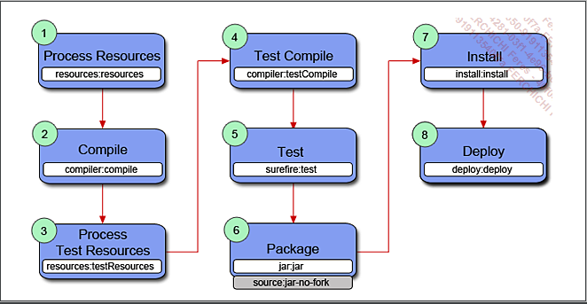

# banque-persistance:
Ce projet s'inscrit dans le cadre de la montée en comptenence sur Maven.


##  Le mode Ligne de commande:
Ils sont de la forme ```mvn [options] [<goal(s)>] [<phase(s)>]```.

Voici un exemple qui montre la liste des options proposées :

```
  $ mvn --help 
     ...  
     Options: 
     ... 
     -D,--define <arg>             Define a system property 
     -V,--show-version             Display version information 
                                            WITHOUT stopping build 
     -v,--version                  Display version information 
     ...
```
cas d'utilisation :

```$ mvn help:effective-pom -Doutput=pom-complet.xml```

:eye_speech_bubble: Lancement du goal du goal help:effective-pom qui permet d'avoir un affichage du POM effectif du projet. Les informations affichées sont une combinaison du contenu du fichier POM, des POM parents et des profiles qui sont actifs. 

## Plugins Maven:

Le plugin est identifié au moment du lancement des commandes maven, en se basant sur le type du projet ( jar, war ou bien ear ),
le cycle maven est retourné avec la configuration adéquat. Les plugins a utilisés leurs noms, leurs versions ainsi dans quelle phase ils
sont rattachés. Tout cela est definie dans le fichier de configuration maven ``components.xml`` sous le repertoire ``MAVEN_HOME/lib/maven-core-3.0.2.jar!META-INF/plexus/components.xml``.

Voivi le cycle DEFAULT pour un projet de type jar : 

```
<?xml version="1.0" encoding="UTF-8"?>
<component>
   <role>org.apache.maven.lifecycle.mapping.LifecycleMapping</role>
   <role-hint>jar</role-hint>
   <implementation>org.apache.maven.lifecycle.mapping.DefaultLifecycleMapping</implementation>
   <configuration>
      <lifecycles>
         <lifecycle>
            <id>default</id>
            <phases>
               <process-resources>org.apache.maven.plugins:maven-resources-plugin:2.6:resources</process-resources>
               <compile>org.apache.maven.plugins:maven-compiler-plugin:3.1:compile</compile>
               <process-test-resources>org.apache.maven.plugins:maven-resources-plugin:2.6:testResources</process-test-resources>
               <test-compile>org.apache.maven.plugins:maven-compiler-plugin:3.1:testCompile</test-compile>
               <test>org.apache.maven.plugins:maven-surefire-plugin:2.12.4:test</test>
               <package>org.apache.maven.plugins:maven-jar-plugin:2.4:jar</package>
               <install>org.apache.maven.plugins:maven-install-plugin:2.4:install</install>
               <deploy>org.apache.maven.plugins:maven-deploy-plugin:2.7:deploy</deploy>
            </phases>
         </lifecycle>
      </lifecycles>
   </configuration>
</component>
 ```

:information_source: Il est très important de définir clairement dans chaque POM les plugins ainsi que les versions utilisées pour le projet. 
Ces informations assurent la stabilité du projet en cas de changement de version d’Apache Maven et donc, potentiellement, 
des versions par défaut des plugins qui vont etre changé d'une version a une autre. 

* Au niveau de l’élément ```<plugins>```, sous-élément de ```<build>``` pour la construction du projet.
  
*  Au niveau de l’élément ```<pluginManagement>``` pour la gestion des plugins.


The [super pom](https://maven.apache.org/ref/3.6.1/maven-model-builder/super-pom.html) defines some parts (folder structure) but the [life cycle binding](https://maven.apache.org/ref/3.6.1/maven-core/default-bindings.html#Plugin_bindings_for_jar_packaging) defines other parts like the binding to the appropriate life cycle phases. The [life cycle phases](https://maven.apache.org/ref/3.6.1/maven-core/lifecycles.html) itself are defined here.
  
The versions of the plugins depend on which version of Maven you are using cause the life cycle binding is being updated. If you like to be sure which version of a plugin is being used the best practice is to define all plugins you are using via pluginManagement in your pom which should be done in a corporate pom file to avoid duplication

### Recherche plugin:
Lors d'une recherche d'un plugin quelconque au moment d'un appel, maven va chercher dans deux endroits (groupID) differents selon la convension de nomage:

* ```org.apache.maven.plugins``` ( les plugin maven) si le nom est de la forme `maven-${name}-plugin`.

exp : le plugin `clean`, `org.apache.maven.plugins:maven-clean-plugin`

* ```org.codehaus.mojo``` si le nom est de la forme `${name}-maven-plugin`.

_*Il est possible d’inclure d’autres groupId dans cette recherche en configurant l’élément `<pluginGroups>` du fichier settings.xml.*_


*Remarque :*
Mojo, pour Maven old java object, est le nom donné à un goal défini par un plugin.
il faut toujours pensé qu'un plugin peut regroupé plusieurs goal, donc mojos.

### Configuration des plugins:
Par defaut chaque plugin possède sa propre configuration, par contre via le ficher pom on peut modifier sa configuration initial.
Via un bloc de `<configuration>` pour plus d'information sur la conf il faut voir le site office Toute la documentation officielle  à l’adresse : http://maven.apache.org/plugins/.

#### Ajouter un traitement à une phase autres à ceux qui sont par defaut:
Lors de l'excution d'un cycle maven, maven va lancer tous les goals qui sont définie par defaut pour chaque phase.
il arrive parfois qu'on veut ajouter un traitement spécifique dans une phase bien déterminée dans un projet,
Il est ainsi possible d’ajouter des traitements grâce à l’exécution de goals de plugins sur une phase du cycle.
exp: ajouter le code source d'un projet dans le jar, cela est faisable grâce au plugin `maven-source-plugin`.

  ```
<plugin> 
    <groupId>org.apache.maven.plugins</groupId> 
    <artifactId>maven-jar-plugin</artifactId> 
    <version>2.4</version> 
    <configuration>...</configuration> 
  </plugin> 
<plugin> 
    <groupId>org.apache.maven.plugins</groupId> 
    <artifactId>maven-source-plugin</artifactId> 
    <version>3.0.1</version>  
    <executions> 
       <execution> 
         <id>attach-source</id>  
         <goals> 
           <goal>jar-no-fork</goal>  
         </goals> 
       </execution> 
    </executions> 
  </plugin>
``` 

C’est le cas, pour le MOJO ```jar-no-fork``` qui est associé à la phase ```package``` comme le plugin jar, avec la valeur attach-source comme identifiant de ce traitement (je peux mettre n'imorte quoi).

 

La phase package exécute désormais deux cibles associées à des plugins différents.

Il est aussi possible de surcharger la phase définie par défaut dans le MOJO du plugin à partir de la configuration du POM

    <executions> 
       <execution> 
         <id>attach-sources</id> 
         <goals> 
           <goal>jar-no-fork</goal> 
         </goals>  
         <phase>verify</phase> 
       </execution> 
    </executions> 
    
Maitenant le goal `jar-nor-fork` est attaché a la phase `verify`.

Il est important de noter que tous les MOJO ne définissent pas obligatoirement de phase par défaut pour s’exécuter. 
heursement le ``jar-nor-fork`` est configuré avec la phase ``package``.
Ainsi, *si dans le POM aucune phase du cycle n’est associée au goal, comme dans l’exemple précédent, celle-ci ne sera pas appelée et le traitement non effectué.*

##  Les dependences Maven:

Nous avons six types de dépendances :
* compile ( disponibles partout )
* runtime ( n'est pas nécessaire à la compilation mais à l'execution )
* provided ( au moment de l'execution elle sera fourni soit par la JDK soit par le Server d'application )
* test (disponible suelement pour les tests unitaires)
* systeme ( disponible en local dans les machines cibles)
* import ( dépendance vers d'autre pom)

on peut voir toute la liste des dépendances avec la commande maven `mvn dependency:tree`

## Héritage et les projets multimodules:

#### POM parent:
Appelé dans le langage Maven le **Corporate** POM (souvent identifié par un artifactId défini autour du mot-clé parent plus explicite).
Ce type de projet (pom parent) possède un cycle de vie maven spécifique ( 1 install -> 2 deploy)
`l’artefact de sortie est le fichier pom.xml qui sera déployé dans le référentiel local et le référentiel distant`. 

#### Reactor projet: 
**Reactor** c'est fichier pom.xml de type pom a pour seul objectif de lister les projets qu’il identifie comme ses modules.

#### Gestion dependences et plugins:

* `Au niveau Pom.xml parent:`

`<dependencyManagement> `:
C'est un point de centralisation pour la gestion des version, scope, and exclusion de dependences qui peuvenet etre utilisés dans les sous modules.
( cad sans que cela soit automatiqument ajoutés dans les sous modules).
Comme ca , on est sure que dans l'application on va utiliser les meme versions de dependances

Ps : Si le module a besoin d'une dependence , il doit l'ajouter dans sa section <dependencies>, elle n'est pas disponible par defaut.

`<dependencies>`
Les dependences qui sont definies a ce niveau vont etre systemetiquement ajoutées dans les sous modules.

`<pluginManagement>` éléments pour les plugins « standard », c’est-à-dire les plugins officiels mis en œuvre dans les cycles de vie par défaut.
``` pluginManagement: is an element that is seen along side plugins. Plugin Management contains plugin elements in much the same way, except that rather than configuring plugin information for this particular project build, it is intended to configure project builds that inherit from this one. However, this only configures plugins that are actually referenced within the plugins element in the children. The children have every right to override pluginManagement definitions.```


`<plugins>` sous-élément direct de <build>, pour les autres plugins associés à des phases spécifiques des cycles de vie dans le POM.
``` <plugins/> is a section for the actual invocation of the plugins. It may or may not be inherited from a <pluginManagement/>.```

* `Au niveau Pom.xml module`:

`<dependencies>`, `<plugins>`
on peut faire des appels direct des dependences qui sont dans le pom parent sans précisé leur version et scope.
Toutefois il est possible de surchargé la definition par defaut du pom parent dans les poms des modules.

## Les propriétés du POM

#### Les propriétés disponibles
Tous les éléments simples du POM sont accessibles à partir du préfixe ```${project.*}``` : exp : 
```${project.artifactId}``` ou meme ```${project.version}``` ....

```${basedir}``` : permet d’accéder au chemin racine du projet
```${env.*}``` : permet d’accéder aux variables d’environnement du système

#### Les propriétés utilisateurs
sont definies dans la section `<properties>` 
```<spring.framework.version>5.1.6.RELEASE</spring.framework.version>```

Et pour l'utilisation c'est fait de la maniere suivante:

	
	<dependency> 
	   <groupId>org.springframework</groupId> 
	   <artifactId>spring-context</artifactId> 
	   <version>${spring.framework.version}</version> 
	</dependency>
	 

#### Les propriétés des plugins
exp : la propiété ```${project.build.sourceEncoding}``` qui est commune à une majorité de plugins.
Pour le ```maven-compiler-plugin```, les déclarations suivantes permettent de configurer les éléments de base du plugin.
   
    
    <properties> 
       ... 
       <maven.compiler.source>1.8</maven.compiler.source> 
       <maven.compiler.target>1.8</maven.compiler.target> 
       <maven.compiler.optimize>true</maven.compiler.optimize> 
       ... 
     </properties> 

:information_source: une propriété définie dans un POM parent peut être surchargée dans le POM enfant dans un premier temps, dans les fichiers settings.xml (lacal et global) et enfin par le biais des options du mode commande ( c'est dans cette ordre que maven va prenndre la derniere valeur pour la propriété).

* Les valeurs des propriétés définies dans le POM peuvent être insérées dans les fichiers de configuration des projets. Ce processus est communément appelé le filtrage des ressources.

```
    <resources> 
        <resource> 
          <directory>src/main/resources</directory>  
          <filter>true</filter> 
        </resource>  
     </resources> 
```

#### Profiles
```
	<profile>
		<id></id>
		<activation></activation>
		<properties></properties>
	</profile>
```
	
Peut etre déclaré dans le fichier ```settings.xml``` ou bien ```pom.xml```.
L'odre conseillée pour l'element ```<profile>``` doit etre le dernier element de configuration.
Il est utilisé dans le fichier ```settings.xml``` pour définir le référentiel destiné à la recherche des artefacts.

* `Activation profil`:
1- Ligne de commande -P : active profile ( par son Id )
2- Dans le fichier ```settings.xml``` balise <activeProfiles> : List of profiles that are active for all builds.
3- Par existence ou absence d'un fichier dans le projet.
4- par systeme d'exploitation ( OS  : sur lequel maven s'execute )
5- par version jdk
6- absence propriété ou égalité sur la valeur d'une propriété.   

* Il ne peut y avoir qu'une seule d'activation par profile* ( un seule methode ).

On peut activer un profile par defaut en utilisant la balise <>activationByDefault>, *cette methode est déconseillé car*
*a partir du momoment ou un autre profile est activé, le profile par defaut se désactive*.

###### Packaging

* shade JAR : *
C'est un jar complet il regroupe les classes du projet principal ainsi les classes des projets de dependances.
Le but de le rendre totalement independant autonome vis-à-vis des serveurs d'applications Java ( voir le livre 3.4.1).